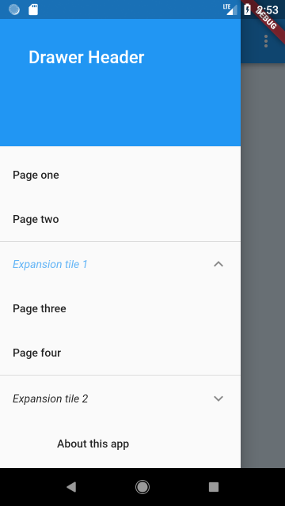
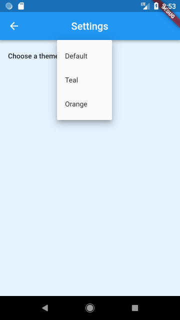
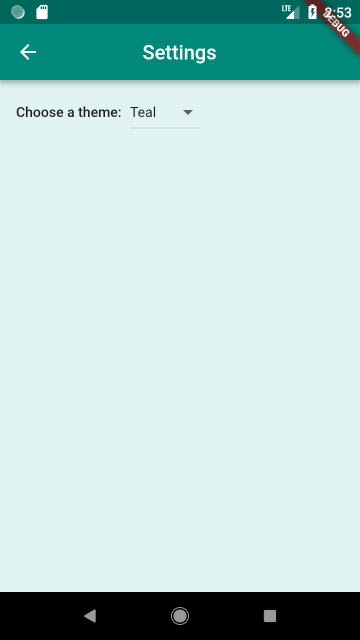
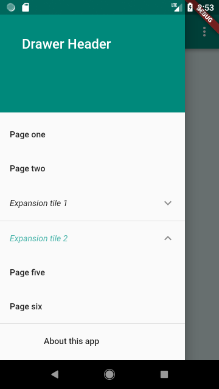

# Starter app

A simple starter app with a drawer and a dynamic theme changer.

- New state management of the library v0.4.0
- Dynamic theme changer
- Drawer with tiles and expansion tiles
- Settings page
- SharedPreferences

### Packages used:

- [Frideos-flutter](https://pub.dartlang.org/packages/frideos)

## Screenshots

